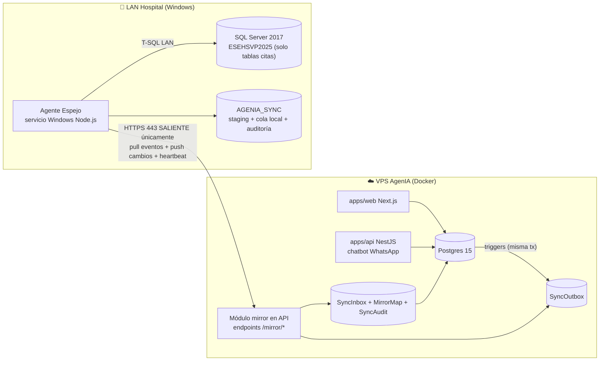

# Plan: Sistema de Espejo de Citas con el HIS del Hospital (SQL Server)

> **Estado:** Fase 0 (Descubrimiento) EN CURSO — respuestas del hospital recibidas 2026-08-23; hallazgos y mapeo en `docs/MAPEO_HIS.md`; incógnitas restantes en la sección 12.
> **Fecha:** 2026-08-23
> **Alcance:** Espejo bidireccional de slots, médicos, citas y catálogos de soporte entre AgenIA (Postgres, nube) y la base de datos del hospital (SQL Server 2017 Standard — corre **sobre Linux Ubuntu 18.04**, hallazgo Fase 0).

---

## 1. Contexto y objetivo

El hospital opera un HIS legado sobre **SQL Server 2017** (versión observada `14.0.3465.1`, servidor `192.168.1.16` en la LAN del hospital) con bases de datos por año (`ESEHSVP`, `ESEHSVP2024`, `ESEHSVP2025`) y **más de 3.000 tablas**. Esa base es delicada: **no se toca su esquema ni sus datos**, salvo los registros estrictamente necesarios en las tablas correctas, identificadas en la fase de análisis.

AgenIA agenda citas por WhatsApp y dashboard web sobre Postgres en la nube. El objetivo:

1. Los **slots** se siguen generando exactamente como hoy; si la bandera de configuración de la organización está encendida, cada slot queda **también** reflejado en la BD espejo del hospital.
2. Lo mismo para la tabla de **médicos**.
3. Lo mismo para las **demás tablas necesarias** para que una cita agendada por WhatsApp quede válida en el sistema del hospital (paciente, servicio, EPS/contrato según lo que exija su modelo).
4. **Bidireccional:** si el hospital crea, modifica o cancela citas desde su sistema, el cambio se refleja en AgenIA. Todo el ciclo de vida de la cita queda en espejo absoluto, con **logs y auditoría** que garanticen que ningún registro se pierda.

### Restricciones duras

| Restricción | Consecuencia de diseño |
|---|---|
| El servidor SQL está en la LAN del hospital, detrás de NAT, con **IP pública dinámica** (`dynamic-ip-…cable.net.co`) y sin políticas de firewall/acceso definidas | Imposible (e imprudente) abrir puertos entrantes. Toda conectividad debe ser **saliente desde el hospital** hacia nuestra nube (HTTPS 443). |
| Acceso actual solo por AnyDesk a una estación Windows (`192.168.1.25`) que sí navega y ve al servidor (`192.168.1.16`) | Necesitamos un **agente instalado dentro de la LAN** que hable con SQL Server localmente y con nuestra nube por HTTPS saliente. |
| **Hallazgo Fase 0:** el motor es SQL Server 2017 **Standard** y corre **sobre Linux (Ubuntu 18.04.6 LTS, fuera de soporte estándar)** — no Windows | Standard ⇒ Change Tracking, CDC y SQL Agent disponibles. El agente corre en la estación Windows (WinSW) o en el host Ubuntu como servicio systemd si TI lo permite y tiene salida a internet. Informar a TI el estado EOL del SO (no es nuestro alcance). |
| La BD del HIS no se puede alterar (ni esquema, ni triggers sobre sus tablas sin autorización) | La detección de cambios en su lado debe ser lo menos intrusiva posible (Change Tracking si lo autorizan; polling si no). Nuestro estado de sincronización vive en una **BD propia separada** (`AGENIA_SYNC`) en el mismo servidor. |
| Mutaciones en AgenIA ocurren en **dos procesos** (API NestJS y server actions de Next.js con Prisma directo) | La captura de cambios en nuestro lado debe hacerse **en la base de datos** (triggers → outbox transaccional), no en la capa de aplicación, o habría escrituras que se escapan. |
| Bases del HIS **por año** (`ESEHSVP2025` → habrá `ESEHSVP2026`) | El nombre del catálogo es **configuración**, nunca hardcode, y el plan incluye el procedimiento de rollover de año. |
| Datos de salud de pacientes en Colombia | Habeas Data (Ley 1581/2012), mínima recolección, cifrado en tránsito, credenciales de mínimo privilegio, sin PHI en logs. |

---

## 2. Estado actual del código (lo que ya existe y se reutiliza)

- **Modelos Prisma** (`packages/database/prisma/schema.prisma`): `Organization` (+ configs 1:1: `OrganizationSettings`, `AiProviderConfig`, `WhatsappAccountConfig`, `OrganizationAudioConfig`), `DoctorProfile`, `MedicalService`, `Eps`, `PatientProfile`, `ScheduleSlot` (`@@unique([doctorId, startTime, endTime])`, 1:1 con `Appointment`), `Appointment` (`origin: MANUAL | WHATSAPP`, `status: SCHEDULED | COMPLETED | CANCELLED`), `GlobalAuditLog`, `SystemLog`.
- **Escritores de slots/citas** (todos deben quedar cubiertos por el espejo):
  - `apps/api/src/appointments/appointments.service.ts` — `bookAppointment` (transacción slot+cita, colisión `SLOT_TAKEN_OR_INVALID`).
  - `apps/api/src/chatbot/chatbot.service.ts` — reservas, cancelaciones y reagendamientos del flujo WhatsApp.
  - `apps/web/app/actions/agenda.ts` — `generateBulkSlots`, `cloneDaySlots`, `deleteSlot` (Prisma directo desde Next.js).
  - `apps/web/app/dashboard/agendamiento/actions.ts` — `createManualAppointmentAction`, `updateManualAppointmentAction`.
  - `apps/api/src/organizations/organizations.service.ts` — `deleteMany` de slots.
  - `apps/api/src/appointment-reminder/appointment-reminder.cron.ts` — actualiza `reminderSentAt` (NO se espeja; es interno).
- **Patrón de configuración por organización 1:1** ya establecido → la bandera del espejo sigue ese patrón.
- **Módulo `monitor`** y `docs/MONITOR_SERVICIOS.md` → el agente espejo se integra a ese esquema de vigilancia.
- **Módulo `hl7-fhir`** → si el HIS resulta tener interfaz HL7/FHIR (pregunta 12.3), es la vía preferida sobre escribir tablas crudas.

---

## 3. Estudio de arquitectura: opciones evaluadas

### 3.1 Conectividad nube ↔ hospital

| Opción | Evaluación |
|---|---|
| **A. Exponer SQL Server a internet** (port-forward 1433) | ❌ Rechazada. IP dinámica, superficie de ataque enorme, SQL Server 2017 expuesto es blanco de ransomware; el hospital no tiene políticas de firewall. |
| **B. VPN clásica (IPSec/OpenVPN) hospital↔nube** | ⚠️ Viable pero pesada: requiere router administrable en el hospital, IP dinámica complica IPSec, y depende del área de TI del hospital que hoy no tiene políticas definidas. |
| **C. Overlay mesh (Tailscale/WireGuard)** | ⚠️ Buena para **acceso operativo nuestro** (reemplazar AnyDesk para soporte), pero como canal de datos productivo crea dependencia de un tercero y de aprobación del hospital para tráfico UDP. Se propone como *plan B / herramienta de soporte*, no como transporte principal. |
| **D. Agente local con conexiones únicamente salientes HTTPS 443** ✅ | **Elegida.** Un servicio Windows liviano dentro de la LAN abre conexiones salientes a nuestra API (igual que un navegador — ya comprobado que la red navega). Sin puertos entrantes, sin VPN, sobrevive a cambios de IP pública, atraviesa cualquier NAT. Es el patrón estándar de conectores on-premise (Azure Hybrid Connections, ngrok agent, Datadog agent). |

### 3.2 Captura de cambios en AgenIA (Postgres → hospital)

| Opción | Evaluación |
|---|---|
| Middleware/extensión Prisma en cada app | ❌ Dos codebases (api + web), raw SQL y `deleteMany` se escapan, frágil ante nuevos call sites. |
| Postgres logical replication / Debezium | ⚠️ Correcto pero sobredimensionado: exige infra Kafka/Debezium para 4–6 tablas de un solo tenant. Contradice el requisito "liviano". |
| **Triggers Postgres → tabla `SyncOutbox` en la MISMA transacción** ✅ | **Elegida.** Cubre a *todos* los escritores presentes y futuros (API, web, seeds, SQL manual). El evento se confirma o se revierte junto con el dato: **cero pérdida por diseño**. Patrón *transactional outbox*. |

### 3.3 Captura de cambios en el hospital (SQL Server → AgenIA)

| Opción | Evaluación |
|---|---|
| Triggers sobre las tablas del HIS | ❌ Por defecto prohibido: altera comportamiento de una BD delicada de 3.000+ tablas. Solo si el hospital/proveedor del HIS lo autoriza explícitamente. |
| **CDC (Change Data Capture)** | ⚠️ Requiere edición Standard+ y SQL Server Agent activo; más pesado. Verificar edición (pregunta 12.2). |
| **Change Tracking (CT)** ✅ preferida | Disponible en **todas** las ediciones de SQL Server 2017 (incluida Express). No modifica el esquema de las tablas, no usa triggers, overhead mínimo. Requiere `ALTER DATABASE … SET CHANGE_TRACKING = ON` y habilitarlo por tabla → **necesita autorización del hospital** (pregunta 12.5). |
| **Polling diferencial (fallback)** ✅ garantizado | Si no autorizan CT: el agente consulta cada N segundos las tablas de citas del HIS filtrando por ventana de fechas relevante (hoy → +13 meses), calcula un hash por fila y compara contra la última foto en `AGENIA_SYNC`. 100 % lectura, cero cambios en su BD. Latencia de detección = intervalo de polling (config, ej. 30–60 s). |

**Decisión:** CT si lo autorizan; polling diferencial como implementación base que funciona sin tocar nada (y queda como fallback permanente).

### 3.4 Escritura hacia el HIS

- **Nunca** desde la nube directo a SQL Server. Solo el **agente local** escribe, con un **login SQL dedicado de mínimo privilegio** (`agenia_sync`): `SELECT` sobre las tablas de lectura, `INSERT/UPDATE` **solo** sobre las tablas exactas del flujo de citas, `db_owner` únicamente sobre `AGENIA_SYNC`. **Prohibido usar el login `ADMIN`** actual (sysadmin) en producción.
- Antes de escribir una sola fila productiva, la Fase 0 debe **trazar cómo el propio HIS inserta una cita** (Extended Events / Profiler sobre una copia de respaldo mientras un funcionario agenda): consecutivos, tablas satélite, estados, valores por defecto. Replicamos ese patrón exacto dentro de una transacción; si el HIS tiene procedimientos almacenados o API propia para agendar (pregunta 12.3), se usan esos en lugar de INSERTs crudos.

---

## 4. Arquitectura elegida



### 4.1 Componentes

**a) `HospitalMirrorConfig` (nuevo modelo Prisma, 1:1 con `Organization`)** — la bandera y su configuración:

```prisma
model HospitalMirrorConfig {
  id             String       @id @default(uuid())
  organizationId String       @unique
  organization   Organization @relation(fields: [organizationId], references: [id], onDelete: Cascade)

  enabled        Boolean  @default(false) // 🚩 LA bandera
  // Identidad del agente on-premise (token hasheado; el secreto solo se muestra al crearlo)
  agentTokenHash String?
  // Catálogo del HIS vivo (confirmado Fase 0: ESEHSVP; los sufijos de año son archivos)
  hisCatalog     String   @default("ESEHSVP")
  // Versión del mapeo de tablas/campos acordado en Fase 0 (JSON versionado)
  mappingVersion Int      @default(1)
  mappingJson    Json?
  // Interruptor de emergencia por dirección
  pushEnabled    Boolean  @default(true)  // AgenIA → HIS
  pullEnabled    Boolean  @default(true)  // HIS → AgenIA
  // Observabilidad
  lastHeartbeatAt DateTime?
  lastPushCursor  BigInt   @default(0)
  createdAt DateTime @default(now())
  updatedAt DateTime @updatedAt
}
```

**b) Outbox transaccional en Postgres** (migración SQL manual, cubre TODOS los escritores):

```sql
CREATE TABLE "SyncOutbox" (
  seq            BIGSERIAL PRIMARY KEY,        -- orden total de entrega
  event_id       UUID NOT NULL DEFAULT gen_random_uuid(),
  organization_id TEXT NOT NULL,
  entity_type    TEXT NOT NULL,  -- 'SLOT' | 'DOCTOR' | 'APPOINTMENT' | 'PATIENT' | 'SERVICE' | 'EPS'
  entity_id      TEXT NOT NULL,
  op             TEXT NOT NULL,  -- 'INSERT' | 'UPDATE' | 'DELETE'
  payload        JSONB NOT NULL, -- fila completa serializada (NEW u OLD)
  origin         TEXT NOT NULL DEFAULT 'LOCAL', -- 'LOCAL' | 'MIRROR' (anti-eco)
  created_at     TIMESTAMPTZ NOT NULL DEFAULT now(),
  delivered_at   TIMESTAMPTZ,     -- NULL = pendiente
  attempts       INT NOT NULL DEFAULT 0,
  dead_lettered  BOOLEAN NOT NULL DEFAULT false
);
CREATE INDEX idx_outbox_pending ON "SyncOutbox" (organization_id, seq) WHERE delivered_at IS NULL;
```

Trigger tipo (uno por tabla espejada — `ScheduleSlot`, `DoctorProfile`, `Appointment`, y las de soporte que defina la Fase 0):

```sql
CREATE OR REPLACE FUNCTION fn_sync_outbox() RETURNS trigger AS $$
DECLARE v_origin TEXT := current_setting('agenia.sync_origin', true); -- anti-eco
BEGIN
  -- Solo organizaciones con la bandera encendida generan eventos
  IF NOT EXISTS (SELECT 1 FROM "HospitalMirrorConfig" c
                 WHERE c."organizationId" = COALESCE(NEW."organizationId", OLD."organizationId")
                   AND c.enabled) THEN
    RETURN COALESCE(NEW, OLD);
  END IF;
  INSERT INTO "SyncOutbox"(organization_id, entity_type, entity_id, op, payload, origin)
  VALUES (COALESCE(NEW."organizationId", OLD."organizationId"),
          TG_ARGV[0], COALESCE(NEW.id, OLD.id), TG_OP,
          to_jsonb(COALESCE(NEW, OLD)),
          COALESCE(v_origin, 'LOCAL'));
  RETURN COALESCE(NEW, OLD);
END $$ LANGUAGE plpgsql;
```

Cuando el módulo mirror **aplica** un cambio que vino del hospital, ejecuta `SET LOCAL agenia.sync_origin = 'MIRROR'` dentro de la transacción: el trigger registra el evento con `origin='MIRROR'` y el dispatcher **no lo reenvía** al hospital (anti-eco; el registro queda igualmente para auditoría).

**c) Módulo `mirror` en `apps/api`** (NestJS, sin servicio nuevo en la nube):
- `POST /mirror/handshake` — el agente se autentica (token → JWT corto), reporta versión, catálogo y reloj (detección de *clock skew*).
- `GET /mirror/events?cursor=N&limit=100` — long-poll (hasta 25 s) de eventos pendientes del outbox, en orden `seq`.
- `POST /mirror/ack` — confirma `seq` aplicados (marca `delivered_at`); reintentos con backoff y paso a `dead_lettered` tras N fallos con alerta.
- `POST /mirror/changes` — el agente sube lotes de cambios detectados en el HIS (idempotentes por `event_id`).
- `POST /mirror/heartbeat` — métricas del agente (lag, profundidad de cola local, errores); alimenta el módulo `monitor`.
- **Aplicación de cambios entrantes:** un `MirrorApplyService` que **reutiliza la lógica de negocio existente** (p. ej. la transacción de `bookAppointment` con su manejo de `SLOT_TAKEN_OR_INVALID`) en lugar de escribir filas a mano — así las invariantes (slot 1:1 cita, aislamiento de tenant, disponibilidad) se respetan igual que en WhatsApp. Citas entrantes usan un nuevo `AppointmentOrigin.MIRROR`.

**d) Agente Espejo (`apps/mirror-agent`)** — microservicio liviano, mismo monorepo:
- **Node.js 20 + TypeScript** (coherente con el stack; driver `mssql`/tedious para SQL Server). Empaquetado con esbuild a un bundle único. Sin NestJS completo: un runtime mínimo (loop de sync + config + logger).
- **Hosting (decisión 2026-08-23): VM Ubuntu dedicada** solicitada a TI del hospital (2 vCPU / 4 GB / 30 GB, red a `192.168.1.16:1433`, salida solo HTTPS 443) — el agente corre como **servicio systemd** (auto-restart, logs en journald). La estación Windows con AnyDesk queda **descartada como host permanente** (es un escritorio compartido que otros usuarios apagan); WinSW en Windows queda solo como plan B si la VM no es posible.
- **Solo conexiones salientes** HTTPS 443 a la nube y T-SQL 1433 dentro de la LAN.
- **Cola local durable:** los eventos bajados de la nube se persisten en `AGENIA_SYNC.dbo.LocalQueue` **antes** de hacer ack; si el internet cae, sigue aplicando lo pendiente y acumula los cambios del HIS para subirlos al volver la conexión. Resultado: tolerancia a cortes prolongados sin pérdida.
- **Aplicación al HIS:** cada evento se aplica en **una transacción SQL Server**; mapeo IDs AgenIA (UUID) ↔ PKs del HIS en `AGENIA_SYNC.dbo.MirrorMap`; toda escritura marca `SESSION_CONTEXT('agenia_sync')=1` para que la detección de cambios ignore nuestras propias escrituras (anti-eco lado hospital).
- **Detección de cambios HIS:** Change Tracking (si se autoriza) o polling diferencial con snapshot/hash en `AGENIA_SYNC` (base garantizada). Ventana: citas de hoy → +13 meses (config).
- **Config local protegida** (credencial SQL `agenia_sync`, token de agente, URL nube, catálogo): en Linux, archivo `root:root 0600` + systemd `LoadCredential`; en el plan B Windows, DPAPI.

**e) Base `AGENIA_SYNC` (nueva, en el servidor SQL del hospital)** — nuestra única huella en su servidor, separada del HIS:
`LocalQueue` (cola durable), `MirrorMap` (ourId ↔ theirPk por entidad), `Snapshot` (hashes para polling), `AppliedEvents` (idempotencia: `event_id` únicos), `SyncAuditLog` (toda operación, resultado, duración, error), `AgentState` (cursores, versión de mapeo).

### 4.2 Flujos punta a punta

**Cita por WhatsApp → HIS** (flag ON):
1. `bookAppointment` confirma su transacción; los triggers dejaron en `SyncOutbox` los eventos `SLOT UPDATE (isAvailable=false)` + `APPOINTMENT INSERT`, **atómicos con la cita**.
2. El agente (long-poll) recibe el lote en orden, lo persiste en `LocalQueue`, hace ack.
3. Aplica en SQL Server en una transacción: resuelve `MirrorMap` (paciente/médico/servicio ya homologados; si el paciente no existe en el HIS, lo crea según el patrón trazado en Fase 0), inserta la cita con el formato exacto del HIS, registra en `SyncAuditLog` y en `AppliedEvents`.
4. Si el HIS rechaza (constraint, dato faltante): reintento con backoff; tras N fallos → `DeadLetter` + alerta a nube en el próximo heartbeat. **El evento jamás se descarta.**

**Cita creada/modificada/cancelada en el HIS → AgenIA:**
1. CT o polling detecta la fila nueva/cambiada (ignorando escrituras propias vía `SESSION_CONTEXT`).
2. El agente arma el evento canónico (UTC ISO-8601; las fechas del HIS son hora local Bogotá → conversión con regla explícita, ver §7), lo guarda y lo sube a `POST /mirror/changes`.
3. `MirrorApplyService` lo aplica con `SET LOCAL agenia.sync_origin='MIRROR'`: crea/ocupa slot y cita (`origin=MIRROR`), o cancela liberando el slot, con las mismas reglas del negocio actual.
4. Conflicto (p. ej. el mismo slot se ocupó por WhatsApp segundos antes): ver §6.

### 4.3 Alcance de entidades espejadas

| Entidad AgenIA | Dirección | Notas |
|---|---|---|
| `ScheduleSlot` | **Derivado:** HIS (`TURNOS_MEDICOS` − citas ocupadas) → AgenIA | **Hallazgo Fase 0 (2ª ronda):** el HIS NO materializa cupos libres — su disponibilidad se calcula de bloques de turno menos citas ocupadas. Para la org espejada, los slots de AgenIA se **generan importando los turnos del HIS** y restando `CITAS_MEDICAS`; `generateBulkSlots` local queda deshabilitado o supeditado a esos turnos para esa organización. |
| `DoctorProfile` | Bidireccional (homologación) | Alta/edición se homologa por cédula/registro; `MirrorMap` enlaza con su tabla de profesionales. |
| `Appointment` | **Bidireccional total** | Crear, reagendar, cancelar, asistencia — espejo absoluto del ciclo de vida. |
| `PatientProfile` | AgenIA → HIS (mínimo necesario) | Solo si el HIS exige que el paciente exista para registrar la cita. Homologación por cédula. |
| `MedicalService`, `Eps` | Catálogo homologado (mapeo estático) | No se sincronizan en vivo: se homologan una vez en Fase 0 (códigos CUPS / códigos EPS del HIS) y viven en `MirrorMap`; cambios poco frecuentes se gestionan con un comando administrativo. |

---

## 5. Garantía de cero pérdida (capas de defensa)

1. **Outbox transaccional** en ambos lados: el evento nace o muere con el dato (misma transacción).
2. **Entrega al-menos-una-vez** con cursores + ack explícito; **aplicación idempotente** (`event_id` único en `AppliedEvents` / `SyncInbox`).
3. **Orden preservado** por `seq` global (y por entidad); un evento que falla bloquea solo su entidad, no toda la cola (colas por `entity_id` en el aplicador).
4. **Dead-letter con alerta**, nunca descarte silencioso; reproceso manual desde el dashboard.
5. **Reconciliación programada** (cada noche + bajo demanda): job que compara por ventana (hoy → +13 meses) hash de citas/slots en ambos lados y reporta toda discrepancia a `SyncAudit` + alerta. Es la red de seguridad que detecta cualquier deriva que las capas 1–4 no hayan cubierto.
6. **Auditoría append-only en ambos extremos** (`SyncAudit` en Postgres, `SyncAuditLog` en `AGENIA_SYNC`): quién, qué, cuándo, payload, resultado. Retención ≥ 1 año.

---

## 6. Resolución de conflictos

- **Regla base (DECIDIDA por el hospital, 2026-08-23): el HIS del hospital gana todo conflicto.** Si el hospital crea, modifica o cancela una cita en su sistema, esa versión prevalece y AgenIA se ajusta; los pacientes consultan las novedades por WhatsApp. Todo conflicto queda igualmente registrado en `SyncAudit` con ambos estados.
- **Casos especiales:**
  - **Doble ocupación del mismo cupo** (WhatsApp y HIS casi simultáneos): la cita del HIS queda; la de AgenIA pasa a conflicto → `WaitlistEntry` + notificación al staff + mensaje WhatsApp al paciente afectado ofreciendo reubicación. Nunca se pisa una cita silenciosamente.
  - **Cancelación vs. modificación cruzadas:** si una de las dos versiones es del HIS, gana el HIS; entre dos acciones de AgenIA, la cancelación (estado terminal) gana.
  - **Agenda:** ambos sistemas siguen agendando (decisión del hospital). La generación de cupos se coordina según el modelo de agenda del HIS (hipótesis `CITAS_MEDICAS` de doble rol — ver `docs/MAPEO_HIS.md` §2.1 y bloqueante #4).
- El **reloj** de la máquina Windows se verifica en cada handshake (NTP/skew); si el skew supera el umbral (ej. 30 s), alerta y se usa el timestamp del servidor nube como referencia.

## 7. Fechas y zonas horarias (regla del repo)

- **Todo el protocolo de sync viaja en UTC ISO-8601.**
- El HIS guarda `datetime` en hora local (America/Bogota, sin offset): el agente convierte **solo en la frontera** SQL Server, usando la zona de `Organization.timezone` (default `America/Bogota`), consistente con los helpers de `@agenia/shared` y la lint rule del repo. Ninguna presentación usa `.toLocale*` sin `timeZone`.

## 8. Seguridad

- **Transporte:** exclusivamente HTTPS/TLS 1.2+ saliente del hospital; opcional mTLS. Token de agente de larga vida **hasheado** en BD + JWT corto por sesión; rotación de token desde el dashboard; revocación inmediata (`enabled=false` corta todo).
- **SQL:** login dedicado `agenia_sync` con permisos mínimos por tabla (auditado en Fase 0 con checklist); `db_owner` solo de `AGENIA_SYNC`; **eliminar el uso del login `ADMIN`** para esta integración; recomendar al hospital rotar esa credencial.
- **Secretos on-premise:** DPAPI (config del agente); **nube:** patrón existente de credenciales cifradas (`CryptoService`).
- **Modo seguro (circuit breaker):** si la tasa de errores de escritura al HIS supera un umbral, el agente **detiene las escrituras** (no las lecturas), alerta y espera intervención — protege la BD delicada de un mapeo defectuoso.
- **Privacidad:** payloads con mínimos datos del paciente necesarios; sin PHI en logs de texto; auditoría con IDs, no con historias clínicas.
- **Acceso operativo:** reemplazar AnyDesk por Tailscale (o similar) *solo para soporte técnico nuestro*, separado del canal de datos.

## 9. Observabilidad y operación

- **Heartbeat** del agente cada 60 s → `HospitalMirrorConfig.lastHeartbeatAt` + métricas (lag de replicación, profundidad de colas, errores, DLQ). Sin heartbeat por > 5 min → alerta (módulo `monitor` + `MONITOR_SERVICIOS.md`).
- **Dashboard "Espejo Hospital"** en `apps/web` (rol ORG_ADMIN/SUPER_ADMIN): estado del agente, lag, últimos eventos, conflictos, dead-letters con botón de reproceso, resultado de la última reconciliación, interruptores `enabled/pushEnabled/pullEnabled`.
- **Runbook** (`docs/RUNBOOK_ESPEJO.md`, se escribe en Fase 5): instalación del agente, rotación de token, rollover de año del catálogo, recuperación ante corte largo, reproceso de DLQ, desastre total (re-seed por reconciliación completa).

## 10. Plan de fases

> Las fases 2+ no arrancan sin cerrar la Fase 0. Cada fase termina con demo + criterios de aceptación.

**Fase 0 — Descubrimiento y análisis del HIS (bloqueante, en sitio/AnyDesk) — EN CURSO**
- ✅ Inventario del motor (Standard sobre Linux), tablas núcleo (`CITAS_MEDICAS`, `MEDICOS`, `PACIENTES`, `SERVICIOS`), grafo de FKs, INSERT de prueba con ROLLBACK exitoso.
- ✅ Laboratorio: la BD **`PRUEBAS`** (copia del HIS en el mismo servidor) reemplaza al backup restaurado en nuestro entorno; backup previo a cualquier intervención en producción.
- ⏳ Resolver los bloqueantes de `MAPEO_HIS.md` §5 con `docs/sql/FASE0_DESCUBRIMIENTO_HIS.sql` (PK de citas, formato de hora, estados, modelo de agenda, convenios, triggers/SPs).
- ⏳ Trazar cómo el HIS crea/modifica/cancela una cita **desde su aplicación** sobre `PRUEBAS` (queries antes/después; Extended Events si hay acceso).
- ⏳ Cerrar el mapeo campo a campo (versionado → `mappingJson`) y la matriz definitiva de permisos de `agenia_sync`.
- *Entregables:* `docs/MAPEO_HIS.md` (creado, en iteración) + `docs/sql/AGENIA_SYNC_SETUP.sql` (creado) + prueba de fuego: cita insertada por SQL visible y usable en la app del HIS, validada por un funcionario.

**Fase 1 — Fundaciones (repo)**
- Migración Prisma: `HospitalMirrorConfig`, `SyncInbox`, `SyncAudit`, enum `AppointmentOrigin.MIRROR`; migración SQL manual: `SyncOutbox` + triggers + índices.
- Módulo `mirror` en `apps/api` (handshake, events, ack, changes, heartbeat) + `MirrorApplyService` + tests jest (idempotencia, anti-eco, orden).
- Esqueleto `apps/mirror-agent` + empaquetado WinSW + script de instalación; creación de `AGENIA_SYNC` (DDL versionado).
- *Aceptación:* outbox captura el 100 % de mutaciones de los 6 escritores listados en §2 (test de integración); flag OFF = cero eventos.

**Fase 2 — Sincronización de agenda y médicos (HIS → AgenIA)** *(redefinida por el hallazgo de `TURNOS_MEDICOS`)*
- Importador de `TURNOS_MEDICOS` + `CITAS_MEDICAS` ocupadas → generación de `ScheduleSlot` en AgenIA para la org espejada (los cupos libres NO se escriben al HIS: no existen como filas allá).
- Homologación de médicos por cédula (maestro = HIS) y de servicios agendables (`ID_CITA_SER='1'`).
- **Modo sombra ≥ 1 semana:** comparar los slots generados contra la pantalla de agenda del HIS antes de exponerlos al chatbot; `generateBulkSlots` local deshabilitado/supeditado para esa org.
- *Aceptación:* reconciliación diaria de agenda sin discrepancias durante 5 días corridos.

**Fase 3 — Espejo AgenIA → HIS: citas (WhatsApp y manuales)**
- Aplicador de `APPOINTMENT` (+ paciente mínimo si aplica). Piloto con un subconjunto (un servicio o un médico) antes de abrir todo.
- *Aceptación:* toda cita WhatsApp aparece válida y usable en la pantalla del HIS (validado por funcionarios del hospital).

**Fase 4 — Espejo HIS → AgenIA (bidireccional completo)**
- Detección de cambios (CT o polling), subida por `/mirror/changes`, aplicación con reglas de conflicto §6, `origin=MIRROR`.
- *Aceptación:* crear/mover/cancelar citas desde el HIS se refleja en AgenIA en < 2 min (polling) o < 30 s (CT); conflictos forzados en prueba quedan registrados y resueltos según regla.

**Fase 5 — Blindaje y operación**
- Reconciliación nocturna + dashboard de espejo + alertas en `monitor` + runbook + prueba de desastre (corte de internet 24 h simulado, caída del agente, rollover de catálogo anual).
- *Aceptación:* game-day superado; documentación entregada.

## 11. Riesgos principales y mitigación

| Riesgo | Prob. | Impacto | Mitigación |
|---|---|---|---|
| El HIS exige filas satélite/consecutivos no evidentes y una cita "cruda" queda inválida en su UI | Alta | Alto | Fase 0 con traza Extended Events sobre copia; preferir SP/API del HIS si existe; piloto Fase 3 validado por funcionarios. |
| No autorizan Change Tracking ni nada sobre su BD | Media | Medio | Diseño base ya es polling 100 % lectura + `AGENIA_SYNC` separada. |
| La máquina con internet es una estación de trabajo compartida que apagan | Alta | Alto | Resuelto por diseño: **VM Ubuntu dedicada solicitada a TI** (correo 2026-08-23, `docs/CORREO_PRUEBA_HIS.md`); la estación Windows queda descartada como host permanente. Mientras llega la VM, la cola durable en `AGENIA_SYNC` tolera apagones sin pérdida. |
| ~~Apuntar el agente al catálogo equivocado~~ **RESUELTO (bloque 18): el catálogo vivo es `ESEHSVP`**; los sufijos de año son archivos de corte anual — no existe rollover | Baja (verificado) | — | `hisCatalog = "ESEHSVP"`. Queda como defensa permanente la alerta de frescura: si el catálogo configurado deja de recibir citas nuevas, alarma inmediata. |
| Credencial `ADMIN`/sysadmin comprometida por prácticas actuales | Media | Crítico | Login mínimo `agenia_sync`; recomendación formal de rotación; nuestro agente jamás usa `ADMIN`. |
| Deriva silenciosa entre sistemas | Media | Alto | Reconciliación nocturna con alerta (capa 5 de §5). |
| Doble agenda del mismo cupo | Media | Alto | Regla de conflicto §6 + waitlist + notificación al staff. |

## 12. Información requerida — estado tras las respuestas del 2026-08-23

Detalle completo de hallazgos y mapeo: **`docs/MAPEO_HIS.md`**. Scripts: `docs/sql/FASE0_DESCUBRIMIENTO_HIS.sql` (solo lectura) y `docs/sql/AGENIA_SYNC_SETUP.sql` (creación de BD/login, con aprobación de TI).

### ✅ Respondidas

| # | Pregunta | Respuesta |
|---|---|---|
| 2 | Edición SQL Server | **Standard 64-bit**, 14.0.3465.1 (RTM-CU31-GDR), **sobre Linux Ubuntu 18.04.6 LTS**. CT/CDC/Agent disponibles. |
| 4 | Backup / ambiente de pruebas | Sí: backup por comando antes de cualquier intervención + **existe la BD `PRUEBAS`** (copia) — todo el desarrollo va contra ella. |
| 5 | Autorización BD + login | Sí, TI receptivo. Pasos completos en `docs/sql/AGENIA_SYNC_SETUP.sql`. CT queda propuesto (sección 5 del script, comentada) pendiente del OK de TI. |
| 7 | Reglas de agenda | **Ambos sistemas siguen agendando; el hospital GANA todo conflicto** (incorporado en §6). |
| 8 | Identificación de pacientes | FK confirmada: solo pacientes existentes en `PACIENTES` pueden tener cita. Homologación por tipo+documento; alta bidireccional con validación previa (ver `MAPEO_HIS.md` §3.3 — el chatbot deberá capturar nacimiento y sexo para pacientes nuevos). |
| 9 | Catálogos | Estructuras de `SERVICIOS`, `MEDICOS`, `PACIENTES`, `CITAS_MEDICAS` y su grafo de FKs relevadas (ver `MAPEO_HIS.md` §2). Homologación: solo el subconjunto agendable. |
| 10 | Volumen | **Solo 15 médicos** ⇒ escala pequeña. El polling diferencial basta con holgura; Change Tracking pasa a opcional. Cifra exacta de citas/día: bloque 13 del script (informativo, ya no bloquea). |
| 11 | Ventanas de mantenimiento | **Los domingos.** Todo despliegue/activación/corte a producción se programa en domingo. |
| 12 | Marco legal | **Existe contrato** de tratamiento de datos con el hospital (Ley 1581) — referenciarlo en el runbook y en la autorización de `AGENIA_SYNC`. |

### ✅ Resueltas en la 2ª ronda del descubrimiento (2026-08-23)

- **PK de `CITAS_MEDICAS`:** compuesta = (`CD_CODI_MED_CIT`, `FE_HORA_CIT`, `NU_ESTA_CIT`) — el estado integra la clave; CT viable; violación de PK = detector natural de colisión de cupo.
- **Formato de `FE_HORA_CIT`:** `'YYYY/MM/DD HH:MM'` (16 chars, **barras**); data legada sucia ⇒ lector tolerante, escritor estricto.
- **Modelo de agenda:** hipótesis del doble rol **refutada** — los cupos libres NO existen como filas; disponibilidad = `TURNOS_MEDICOS` (bloques de turno) − citas ocupadas ⇒ slots AgenIA **derivados** (Fase 2 redefinida).
- **Vía de escritura:** sin triggers, sin SPs de agendamiento, módulo web sin uso ⇒ **DML directo** replicando el patrón de la app.
- **Pacientes:** historia = documento (100% de 78.654); defaults confirmados; catálogo `TIPO_DOCUMENTO` completo.
- **Servicios agendables:** `ID_CITA_SER='1'` (1.280 servicios; 100% de las citas de 90 días).
- **Volumen:** ~250–300 citas/día hábil; reservas hasta 12 meses adelante ⇒ ventana de sincronización **+13 meses**.

### ✅ Resueltas además en la 4ª ronda (catálogo vivo, 2026-08-23)

- **Catálogo vivo = `ESEHSVP`** (última elaboración 2026-08-22, 1.652 citas/7d); `ESEHSVP2024/2025` son archivos anuales; `PRUEBAS` = copia del 15-ago ⇒ **no existe rollover anual**.
- **Plantilla del INSERT de cita campo a campo** (`MAPEO_HIS.md` §2.1): constantes, NULLs, `DE_DESC=''`, consultorio copiado del turno del día, `FE_SOLI` ≈ hora de la cita.
- **Regla de convenios:** EPS (NIT) + régimen + PyP → convenio vigente; `R_PAC_CONV` descartada; tabla de 12 convenios homologada, números estables entre años.
- **Turnos vivos:** 1.120 turnos futuros de 27 médicos hasta ago-2027; `ID_DISP='1'` = activo.
- **Volumen vivo:** 27.877 citas/90d, ≈235/día.

### ⏳ Pendientes

1. **Prueba manual del ciclo de vida (bloque 17) — LA ÚNICA crítica restante:** al cancelar desde la app, ¿la fila cambia `NU_ESTA_CIT` en sitio, aparece fila nueva, o se BORRA? (cero citas futuras en estado 2 sugiere DELETE). Define la detección HIS→AgenIA.
2. **Fuentes contextuales del INSERT (bloque 21):** consecutivo de sesión (`CONEXION*`/`CONSECUTIVOS`), especialidad (¿`R_ESP_SER`?), consultorio/centro de costos/sede (`CONSULTORIOS`). Última milla del INSERT.
3. **Validar la tabla de decisión de convenios con la agendadora** del hospital (Fase 2).
4. **¿27 o 15 médicos?** El catálogo vivo muestra 27 médicos con turnos futuros — confirmar cuáles entran al agendamiento por WhatsApp.
5. **VM Ubuntu para el agente** (solicitada en `docs/CORREO_PRUEBA_HIS.md`) y confirmar salida a internet de la red de servidores.
6. **Proveedor del HIS:** pista fuerte = **CNT Sistemas de Información** (jobs/backups `copia_cnt`, `…_cnt.bak` — bloque 20a); confirmar con TI, junto con soporte vigente.
7. **Alcance de `CITAS_TELEMEDICINA`** (¿entra al espejo?). *(Verificados ya: jobs del servidor no interfieren ✔; turnos tipo 1 no existen a futuro ✔; `TIPOSERVICIO` completo — el valor 1 no existe ✔.)*

---

## Apéndice A — Decisiones de diseño resumidas

| Tema | Decisión |
|---|---|
| Conectividad | Agente on-premise, solo HTTPS saliente 443; sin puertos entrantes, sin VPN productiva. |
| Captura lado AgenIA | Triggers Postgres → `SyncOutbox` transaccional (cubre api + web + cualquier escritor). |
| Captura lado HIS | Change Tracking si se autoriza; polling diferencial de solo lectura como base/fallback. |
| Escritura al HIS | Solo el agente local, login mínimo `agenia_sync`, transacciones, patrón trazado del HIS o sus SP oficiales. |
| Estado de sync en el hospital | BD propia `AGENIA_SYNC` — cero objetos dentro de las BD del HIS. |
| Transporte de eventos | Pull con cursor + ack (nube→hospital), push por lotes idempotente (hospital→nube), long-poll/heartbeat. |
| Entrega | Al-menos-una-vez + idempotencia por `event_id` + orden por `seq` + DLQ con alerta. |
| Conflictos | LWW con desempate determinista; cancelación gana; doble-cupo → waitlist + staff; todo conflicto auditado. |
| Anti-eco | `SET LOCAL agenia.sync_origin` (Postgres) y `SESSION_CONTEXT` (SQL Server). |
| Fechas | Protocolo en UTC; conversión solo en fronteras con `Organization.timezone` (regla CLAUDE.md). |
| Runtime agente | Node 20 + TS, bundle esbuild, **servicio systemd en VM Ubuntu dedicada** (plan B: WinSW en Windows), config protegida (0600/LoadCredential; DPAPI en plan B), cola durable en `AGENIA_SYNC`. |
| Bandera | `HospitalMirrorConfig.enabled` por organización, + interruptores por dirección y circuit breaker. |
