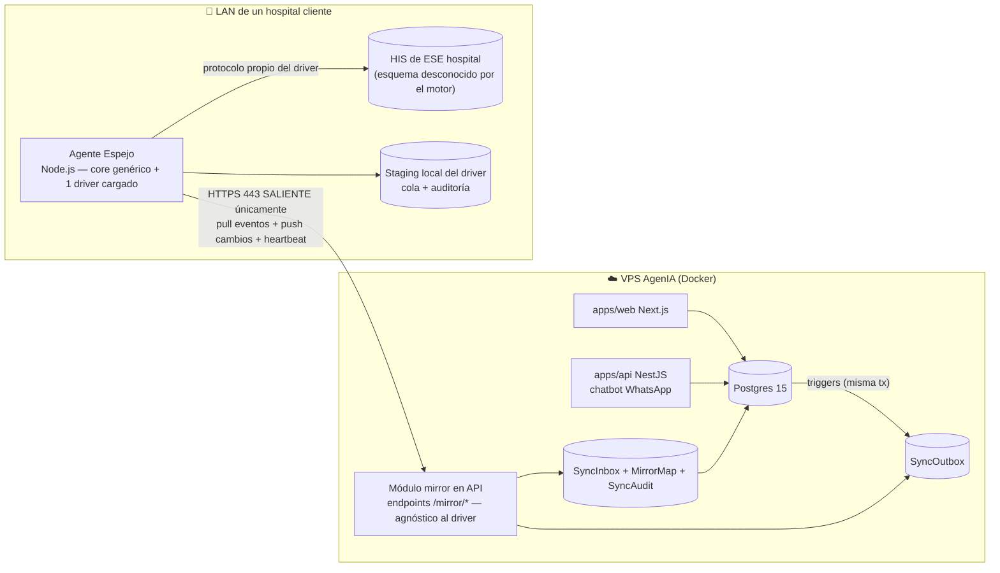

# Arquitectura: Motor de Espejo de Citas con HIS externos (patrón de Drivers)

> **Estado:** Motor genérico diseñado. Primer driver (**CNT — Hospital San Vicente de Paul de Anserma**) en Fase 0 avanzada, bloqueante crítico resuelto — ver `docs/drivers/cnt-sanvicente-anserma/ESTADO.md`.
> **Fecha:** 2026-08-23 (última revisión: introducción del patrón de drivers).
> **Alcance:** Espejo bidireccional de slots, médicos, citas y catálogos de soporte entre AgenIA (Postgres, nube) y el sistema de historia clínica (HIS) de **cada hospital cliente que lo requiera** — cada HIS es distinto, así que el conocimiento específico de cada uno vive aislado en un **driver**.

---

## 0. Por qué este documento cambió de forma

El primer cliente en pedir este espejo es el **Hospital San Vicente de Paul de Anserma**, cuyo HIS corre sobre un motor específico (SQL Server, aparentemente de CNT Sistemas de Información) con un esquema, unas reglas de negocio y unas restricciones de infraestructura que son **enteramente propias de ese hospital**. El siguiente cliente con este requisito tendrá, con altísima probabilidad, un HIS distinto: otro proveedor, otro motor de base de datos, otro modelo de tablas, otras reglas de cancelación, quizás incluso una API en vez de acceso directo a BD.

Por eso este documento describe **dos cosas separadas, y las separa a propósito**:

1. **El motor genérico** (este documento): outbox transaccional, cola durable, idempotencia, reconciliación, motor de resolución de conflictos, dashboard, alertas — todo esto es igual sin importar qué HIS haya al otro lado. Se escribe **una sola vez** y lo reutiliza cualquier hospital.
2. **Los drivers** (uno por hospital/HIS, documentados aparte en `docs/drivers/<driverKey>/`): el conocimiento específico de cómo hablar con el HIS de ese hospital en particular — su esquema de tablas, su formato de fechas, sus catálogos de motivos y convenios, su forma exacta de insertar una cita. **Nada de esto contamina el motor genérico ni el modelo de datos de AgenIA.**

Este documento **ya no debe contener** hallazgos específicos de un hospital (nombres de tablas SQL Server, catálogos de motivos, IPs de servidores). Cuando algo de ese tipo aparecía aquí antes, ahora es un ejemplo explícitamente marcado como *"así lo resuelve el driver CNT-Anserma"*, con el detalle real movido a su carpeta de driver.

---

## 1. Patrón de Drivers HIS

### 1.1 Qué es un driver

Un **driver** es la implementación concreta, para un hospital/HIS específico, de un contrato común (`HisDriver`). Encapsula **todo** lo que ese HIS tiene de particular:

- Cómo conectarse (SQL Server, otra BD, una API REST/HL7-FHIR si el proveedor la ofrece).
- Cómo leer su disponibilidad real (en el caso de Anserma: turnos menos citas ocupadas; otro HIS podría materializar cupos libres directamente).
- Cómo insertar/cancelar una cita reproduciendo el patrón exacto que su propia aplicación usa (formato de fechas, catálogos, campos obligatorios, tablas satélite).
- Cómo detectar cambios hechos desde la aplicación del hospital (Change Tracking, CDC, polling diferencial, o un webhook si el HIS lo ofrece).
- Cómo homologar catálogos (convenios/EPS, tipos de documento, servicios agendables) — el mapeo estático específico de ese hospital.

### 1.2 Qué NUNCA vive en un driver

El **motor genérico** —outbox transaccional en Postgres, protocolo `/mirror/*`, cola durable, idempotencia, reconciliación, motor de conflictos, alertas, dashboard— es agnóstico al driver. Un driver nunca decide *reglas de negocio de AgenIA* (esas están en `HospitalMirrorConfig` y se configuran por organización, no por driver); un driver solo sabe **traducir** entre el evento canónico de AgenIA y las particularidades de un HIS externo.

### 1.3 Dónde vive el código y la documentación de cada driver

```
apps/mirror-agent/
  src/
    core/                   # motor genérico — agnóstico a cualquier HIS
    drivers/
      cnt-sanvicente-anserma/   # primer driver
      <driverKey-2>/            # el segundo hospital, cuando llegue

docs/
  PLAN_ESPEJO_HOSPITAL.md       # este documento — arquitectura genérica
  drivers/
    cnt-sanvicente-anserma/
      MAPEO_HIS.md               # mapeo técnico del esquema de ESE HIS
      ESTADO.md                  # preguntas/respuestas y pendientes de ESE hospital
      CORREO_PRUEBA_HIS.md
      sql/                       # scripts de descubrimiento/setup de ESE servidor
      evidencia/                 # capturas y pruebas manuales de ESE hospital
    <driverKey-2>/
      ...
```

### 1.4 Contrato `HisDriver` (interfaz que todo driver implementa)

```typescript
interface HisDriver {
  readonly key: string; // ej. "cnt-sanvicente-anserma" — coincide con HospitalMirrorConfig.driverKey

  // Conectividad y salud
  connect(config: DriverConnectionConfig): Promise<void>;
  healthCheck(): Promise<{ ok: boolean; detail?: string }>;

  // HIS → AgenIA (lectura de disponibilidad y cambios)
  fetchAvailability(window: { from: Date; to: Date }): Promise<CanonicalSlot[]>;
  detectChanges(since: DriverCursor): Promise<CanonicalChangeEvent[]>; // CT, CDC o polling — decisión interna del driver

  // AgenIA → HIS (escritura)
  createAppointment(evt: CanonicalAppointmentCreate): Promise<DriverResult>;
  cancelAppointment(evt: CanonicalAppointmentCancel): Promise<DriverResult>;
  updateAttendance(evt: CanonicalAttendanceUpdate): Promise<DriverResult>;

  // Homologación de catálogos propios del HIS (convenios, EPS, tipos de doc, servicios agendables)
  resolveCatalogMapping(kind: CatalogKind, agenIAId: string): Promise<string | null>;
}
```

El motor genérico (`core/`) llama siempre a través de esta interfaz. Nunca importa nada específico de un driver (ni un nombre de tabla, ni un formato de fecha de un HIS en particular).

### 1.5 Cómo se selecciona el driver de una organización

`HospitalMirrorConfig.driverKey` (nuevo campo, ver §4.1) identifica qué implementación cargar para esa organización. El agente, al arrancar, lee su configuración, resuelve `driverKey` y solo entonces sabe con qué HIS va a hablar — el resto del motor no cambia una línea entre un driver y otro.

---

## 2. Contexto y objetivo (motor genérico)

AgenIA agenda citas por WhatsApp y dashboard web sobre Postgres en la nube. El objetivo del motor de espejo, para cualquier hospital que lo active:

1. Los **slots** se siguen generando exactamente como hoy; si la bandera de configuración de la organización está encendida, cada slot queda **también** reflejado en el HIS del hospital, vía su driver.
2. Lo mismo para la tabla de **médicos**.
3. Lo mismo para las **demás entidades necesarias** para que una cita agendada por WhatsApp quede válida en el HIS (paciente, servicio, EPS/contrato según lo que exija el driver de ese hospital).
4. **Bidireccional:** si el hospital crea, modifica o cancela citas desde su propio sistema, el cambio se refleja en AgenIA. Todo el ciclo de vida de la cita queda en espejo absoluto, con **logs y auditoría** que garanticen que ningún registro se pierda.

### Restricciones duras del motor (aplican a cualquier driver)

| Restricción | Consecuencia de diseño |
|---|---|
| El HIS de un hospital cliente típicamente vive en su LAN, sin política de exposición a internet garantizada | El motor asume por defecto que **no hay conectividad entrante**: toda comunicación agente↔nube es **saliente desde el hospital** hacia AgenIA (HTTPS 443). Un driver que sí tenga una API pública oficial es la excepción, no la regla de diseño. |
| Mutaciones en AgenIA ocurren en **dos procesos** (API NestJS y server actions de Next.js con Prisma directo) | La captura de cambios en nuestro lado debe hacerse **en la base de datos** (triggers → outbox transaccional), no en la capa de aplicación, o habría escrituras que se escapan — esto es así sin importar el driver. |
| La BD/sistema del HIS de un hospital suele ser delicada (producción crítica, a veces miles de tablas) | Por defecto: **no se toca su esquema**. La detección de cambios debe ser lo menos intrusiva posible; el estado de sincronización de cada driver vive en almacenamiento propio, nunca mezclado con las tablas del HIS. |
| Datos de salud de pacientes en Colombia | Habeas Data (Ley 1581/2012), mínima recolección (§4.3 — nunca se precargan pacientes en bloque), cifrado en tránsito, credenciales de mínimo privilegio, sin PHI en logs. |

*(Las restricciones específicas del primer driver — IP dinámica del hospital, SQL Server sobre Linux, estación compartida con AnyDesk, bases de datos por año — están documentadas en `docs/drivers/cnt-sanvicente-anserma/MAPEO_HIS.md` §1, no aquí: son propias de ESE hospital, no del motor.)*

---

## 3. Estado actual del código AgenIA (lo que ya existe y se reutiliza)

- **Modelos Prisma** (`packages/database/prisma/schema.prisma`): `Organization` (+ configs 1:1: `OrganizationSettings`, `AiProviderConfig`, `WhatsappAccountConfig`, `OrganizationAudioConfig`), `DoctorProfile`, `MedicalService`, `Eps`, `PatientProfile`, `ScheduleSlot` (`@@unique([doctorId, startTime, endTime])`, 1:1 con `Appointment`), `Appointment` (`origin: MANUAL | WHATSAPP`, `status: SCHEDULED | COMPLETED | CANCELLED`), `GlobalAuditLog`, `SystemLog`.
- **Escritores de slots/citas** (todos deben quedar cubiertos por el outbox, sin importar el driver):
  - `apps/api/src/appointments/appointments.service.ts` — `bookAppointment` (transacción slot+cita, colisión `SLOT_TAKEN_OR_INVALID`).
  - `apps/api/src/chatbot/chatbot.service.ts` — reservas, cancelaciones y reagendamientos del flujo WhatsApp.
  - `apps/web/app/actions/agenda.ts` — `generateBulkSlots`, `cloneDaySlots`, `deleteSlot` (Prisma directo desde Next.js).
  - `apps/web/app/dashboard/agendamiento/actions.ts` — `createManualAppointmentAction`, `updateManualAppointmentAction`.
  - `apps/api/src/organizations/organizations.service.ts` — `deleteMany` de slots.
  - `apps/api/src/appointment-reminder/appointment-reminder.cron.ts` — actualiza `reminderSentAt` (NO se espeja; es interno).
- **Patrón de configuración por organización 1:1** ya establecido → `HospitalMirrorConfig` sigue ese patrón.
- **Módulo `monitor`** y `docs/MONITOR_SERVICIOS.md` → el agente espejo (de cualquier driver) se integra a ese esquema de vigilancia.
- **Módulo `hl7-fhir`** existente → si algún driver futuro resulta tener interfaz HL7/FHIR oficial, es la vía preferida sobre escribir tablas crudas (no aplica al driver CNT-Anserma: se descartó, ver su `MAPEO_HIS.md`).

---

## 4. Estudio de arquitectura: opciones evaluadas (motor genérico)

### 4.1 Conectividad nube ↔ hospital

| Opción | Evaluación |
|---|---|
| **A. Exponer la BD del HIS a internet** | ❌ Rechazada como default. Superficie de ataque enorme; un HIS de hospital expuesto es blanco de ransomware. Un driver con API pública oficial del proveedor podría ser la excepción. |
| **B. VPN clásica (IPSec/OpenVPN) hospital↔nube** | ⚠️ Viable pero pesada por hospital: requiere router administrable y depende del área de TI de cada cliente. |
| **C. Overlay mesh (Tailscale/WireGuard)** | ⚠️ Buena para **acceso operativo nuestro** (soporte remoto), pero como canal de datos productivo crea dependencia de un tercero. Plan B / herramienta de soporte, no transporte principal. |
| **D. Agente local con conexiones únicamente salientes HTTPS 443** ✅ | **Elegida como default del motor.** Un servicio dentro de la LAN del hospital abre conexiones salientes a nuestra API. Sin puertos entrantes, sin VPN, sobrevive a cambios de IP pública, atraviesa cualquier NAT. Patrón estándar de conectores on-premise (Azure Hybrid Connections, ngrok agent, Datadog agent). |

### 4.2 Captura de cambios en AgenIA (Postgres → cualquier hospital)

| Opción | Evaluación |
|---|---|
| Middleware/extensión Prisma en cada app | ❌ Dos codebases (api + web), raw SQL y `deleteMany` se escapan, frágil ante nuevos call sites. |
| Postgres logical replication / Debezium | ⚠️ Correcto pero sobredimensionado para 4–6 tablas por tenant. Contradice el requisito "liviano". |
| **Triggers Postgres → tabla `SyncOutbox` en la MISMA transacción** ✅ | **Elegida.** Cubre a *todos* los escritores presentes y futuros (API, web, seeds, SQL manual), sin importar cuántos drivers estén activos. El evento se confirma o se revierte junto con el dato: **cero pérdida por diseño**. Patrón *transactional outbox*. |

### 4.3 Captura de cambios en el HIS (hospital → AgenIA) — decisión que cada driver hace por sí mismo

| Opción | Cuándo la usa un driver |
|---|---|
| Webhook/API oficial del proveedor del HIS | Si existe y el proveedor lo soporta — la vía más limpia, pero rara en HIS legados. |
| **Change Data Capture (CDC)** | Motores que lo soporten y con SQL Agent activo. |
| **Change Tracking (CT)** — preferida para SQL Server | No modifica esquema, no usa triggers, overhead mínimo. Requiere autorización explícita del hospital. |
| **Polling diferencial (fallback universal)** ✅ garantizado | Cualquier driver puede implementarlo con solo permisos de lectura: consulta periódica, hash por fila, compara contra la última foto guardada por el driver. 100 % lectura, cero cambios en el sistema del hospital. |

**Regla general del motor:** todo driver debe poder operar en modo polling diferencial sin ningún permiso especial del hospital — es el piso mínimo garantizado. CT/CDC/webhook son mejoras de latencia que un driver adopta si el hospital las autoriza.

### 4.4 Escritura hacia el HIS

- **Nunca** desde la nube directo al sistema del hospital. Solo el **agente local**, a través de su driver, con credenciales de **mínimo privilegio** dedicadas a la integración. Prohibido usar credenciales administrativas/sysadmin del hospital en producción, sin importar el driver.
- Antes de que cualquier driver escriba una sola fila productiva, su Fase 0 debe **trazar cómo la propia aplicación del hospital crea una cita** (ver el patrón seguido por el driver CNT-Anserma en su `MAPEO_HIS.md` §2.1 como referencia) y replicar ese patrón exacto — o usar la API/SP oficial si el HIS la ofrece.

---

## 5. Arquitectura elegida (motor genérico)



*(Esta subgrafo "HOSPITAL" se repite una vez por hospital cliente activo, cada uno con su propio driver cargado — no es una topología 1:1 fija con un solo hospital.)*

### 5.1 Componentes

**a) `HospitalMirrorConfig` (modelo Prisma, 1:1 con `Organization`)** — la bandera, el driver a usar, y su configuración:

```prisma
model HospitalMirrorConfig {
  id             String       @id @default(uuid())
  organizationId String       @unique
  organization   Organization @relation(fields: [organizationId], references: [id], onDelete: Cascade)

  enabled        Boolean  @default(false) // 🚩 LA bandera
  // 🔌 Qué driver habla con el HIS de esta organización (ver §1.5). Ej. "cnt-sanvicente-anserma".
  // Sin este campo el motor no sabría con qué implementación conectar — es la bisagra entre
  // el motor genérico y el conocimiento específico de cada hospital.
  driverKey      String
  // Identidad del agente on-premise (token hasheado; el secreto solo se muestra al crearlo)
  agentTokenHash String?
  // Payload de configuración PROPIO del driver (nombre de catálogo/BD, endpoints, flags —
  // cada driver define su propia forma; el motor solo lo pasa sin interpretarlo)
  driverConfig   Json?
  // Versión del mapeo de tablas/campos acordado en la Fase 0 de ESE driver (JSON versionado)
  mappingVersion Int      @default(1)
  mappingJson    Json?
  // Interruptor de emergencia por dirección
  pushEnabled    Boolean  @default(true)  // AgenIA → HIS
  pullEnabled    Boolean  @default(true)  // HIS → AgenIA
  // Observabilidad
  lastHeartbeatAt DateTime?
  lastPushCursor  BigInt   @default(0)

  // 🔔 ALERTAS DE CONFLICTO (motor genérico, requisito de negocio confirmado con el primer
  // hospital cliente): cuando un conflicto de agenda (doble-cupo) manda una cita a
  // WaitlistEntry, se avisa al agendador. Configurable — se puede apagar sin tocar código.
  conflictAlertsEnabled Boolean @default(true)
  agendadorWhatsapp     String? // número E.164 del agendador responsable
  agendadorEmail        String? // correo del agendador responsable

  createdAt DateTime @default(now())
  updatedAt DateTime @updatedAt
}
```

> ⚠️ Nota de diseño: `hisCatalog` (nombre de una BD/catálogo) **no es un campo del modelo genérico** — algunos drivers lo necesitan (SQL Server con bases por año, como CNT-Anserma) y otros no (un driver basado en API REST no tiene "catálogo"). Ese dato vive dentro de `driverConfig`, interpretado únicamente por el driver correspondiente.

**Alertas de conflicto — diseño (parte del motor genérico, no de ningún driver):** cuando el `MirrorApplyService` detecta que un slot ya fue tomado (§8) y manda la cita perdedora a `WaitlistEntry`, si `conflictAlertsEnabled=true` dispara **tres canales en paralelo**, ninguno bloqueante entre sí:
1. **WhatsApp** al número `agendadorWhatsapp` (reutiliza la infraestructura de envío ya existente del chatbot).
2. **Email** a `agendadorEmail` — ⚠️ **dependencia técnica a verificar en Fase 1:** el stack actual es WhatsApp-céntrico; confirmar si ya existe un proveedor SMTP/transaccional integrado en `apps/api` o si hay que añadirlo.
3. **Alerta in-app** para el rol `BOOKING_AGENT` (ya existe en el enum `Role`): nuevo modelo `MirrorConflictAlert` (1:1 con la `WaitlistEntry` que la originó), visible al iniciar sesión en el dashboard hasta marcarse como vista/resuelta. *(Se evaluó reusar `ServiceIncident`, pero ese modelo es específico de monitoreo de proveedores externos — Gemini/TTS/Meta — no aplica aquí.)*

```prisma
model MirrorConflictAlert {
  id              String        @id @default(uuid())
  organizationId  String
  organization    Organization  @relation(fields: [organizationId], references: [id])
  waitlistEntryId String        @unique
  waitlistEntry   WaitlistEntry @relation(fields: [waitlistEntryId], references: [id])

  whatsappSentAt DateTime? // null = no enviado / error
  emailSentAt    DateTime?
  seenByStaffAt  DateTime? // marcado como visto en el dashboard

  createdAt DateTime @default(now())

  @@index([organizationId, seenByStaffAt])
}
```

> ⚠️ **Checklist de implementación (verificado contra el schema real al validar este plan):** `Organization` en este repo declara explícitamente cada relación inversa como array (`slots ScheduleSlot[]`, `waitlistEntries WaitlistEntry[]`, etc. — no usa relaciones implícitas). Al migrar, agregar también `hospitalMirrorConfig HospitalMirrorConfig?` y `mirrorConflictAlerts MirrorConflictAlert[]` al modelo `Organization`, y `mirrorConflictAlert MirrorConflictAlert?` al modelo `WaitlistEntry` — sin estos campos inversos `prisma validate` falla. Los snippets de este documento muestran solo el lado "nuevo"; el lado existente de cada relación debe editarse también.
>
> **Nota de ajuste (no bloqueante):** `WaitlistEntry.metadata` ya está pensado para guardar contexto de un slot (`{ pendingSlotId, doctorName, slotDate }`) — es reutilizable para guardar ahí el slot original que perdió el paciente por el conflicto, sin necesidad de campos nuevos en `WaitlistEntry`.

**b) Outbox transaccional en Postgres** (migración SQL manual, cubre TODOS los escritores, agnóstico a cuántos drivers estén activos):

```sql
CREATE TABLE "SyncOutbox" (
  seq            BIGSERIAL PRIMARY KEY,        -- orden total de entrega
  event_id       UUID NOT NULL DEFAULT gen_random_uuid(),
  organization_id TEXT NOT NULL,
  entity_type    TEXT NOT NULL,  -- 'SLOT' | 'DOCTOR' | 'APPOINTMENT' | 'PATIENT' | 'SERVICE' | 'EPS'
  entity_id      TEXT NOT NULL,
  op             TEXT NOT NULL,  -- 'INSERT' | 'UPDATE' | 'DELETE'
  payload        JSONB NOT NULL, -- fila completa serializada (NEW u OLD) — formato canónico AgenIA
  origin         TEXT NOT NULL DEFAULT 'LOCAL', -- 'LOCAL' | 'MIRROR' (anti-eco)
  created_at     TIMESTAMPTZ NOT NULL DEFAULT now(),
  delivered_at   TIMESTAMPTZ,     -- NULL = pendiente
  attempts       INT NOT NULL DEFAULT 0,
  dead_lettered  BOOLEAN NOT NULL DEFAULT false
);
CREATE INDEX idx_outbox_pending ON "SyncOutbox" (organization_id, seq) WHERE delivered_at IS NULL;
```

`entity_type`/`payload` son el **formato canónico** de AgenIA — el mismo para cualquier hospital. La traducción a lo que cada HIS específico necesita ocurre **solo dentro del driver**, del lado del agente.

Trigger tipo (uno por tabla espejada — `ScheduleSlot`, `DoctorProfile`, `Appointment`, y las de soporte que cada organización requiera):

```sql
CREATE OR REPLACE FUNCTION fn_sync_outbox() RETURNS trigger AS $$
DECLARE v_origin TEXT := current_setting('agenia.sync_origin', true); -- anti-eco
BEGIN
  -- Solo organizaciones con la bandera encendida generan eventos
  IF NOT EXISTS (SELECT 1 FROM "HospitalMirrorConfig" c
                 WHERE c."organizationId" = COALESCE(NEW."organizationId", OLD."organizationId")
                   AND c.enabled) THEN
    RETURN COALESCE(NEW, OLD);
  END IF;
  INSERT INTO "SyncOutbox"(organization_id, entity_type, entity_id, op, payload, origin)
  VALUES (COALESCE(NEW."organizationId", OLD."organizationId"),
          TG_ARGV[0], COALESCE(NEW.id, OLD.id), TG_OP,
          to_jsonb(COALESCE(NEW, OLD)),
          COALESCE(v_origin, 'LOCAL'));
  RETURN COALESCE(NEW, OLD);
END $$ LANGUAGE plpgsql;
```

Cuando el módulo mirror **aplica** un cambio que vino de un hospital, ejecuta `SET LOCAL agenia.sync_origin = 'MIRROR'` dentro de la transacción: el trigger registra el evento con `origin='MIRROR'` y el dispatcher **no lo reenvía** a ningún driver (anti-eco; el registro queda igualmente para auditoría).

**c) Módulo `mirror` en `apps/api`** (NestJS, sin servicio nuevo en la nube — **100% agnóstico al driver**: solo conoce el formato canónico):
- `POST /mirror/handshake` — el agente se autentica (token → JWT corto), reporta versión, `driverKey` y reloj (detección de *clock skew*).
- `GET /mirror/events?cursor=N&limit=100` — long-poll (hasta 25 s) de eventos pendientes del outbox, en orden `seq`.
- `POST /mirror/ack` — confirma `seq` aplicados (marca `delivered_at`); reintentos con backoff y paso a `dead_lettered` tras N fallos con alerta.
- `POST /mirror/changes` — el agente sube lotes de cambios detectados en el HIS, **ya canonicalizados por su driver** (idempotentes por `event_id`).
- `POST /mirror/heartbeat` — métricas del agente (lag, profundidad de cola local, errores); alimenta el módulo `monitor`.
- **Aplicación de cambios entrantes:** un `MirrorApplyService` que **reutiliza la lógica de negocio existente** (p. ej. la transacción de `bookAppointment` con su manejo de `SLOT_TAKEN_OR_INVALID`) en lugar de escribir filas a mano — así las invariantes (slot 1:1 cita, aislamiento de tenant, disponibilidad) se respetan igual que en WhatsApp, sin importar de qué driver vino el evento. Citas entrantes usan un nuevo `AppointmentOrigin.MIRROR`.

> **Insight de diseño clave:** el módulo `mirror` de `apps/api` **nunca sabe qué driver está detrás** de un evento — solo ve el formato canónico (`entity_type`, `payload`). Toda la complejidad específica de un HIS vive exclusivamente en `apps/mirror-agent/src/drivers/<driverKey>/`, del lado del agente on-premise. Esto es lo que permite añadir un segundo, tercer, enésimo hospital sin tocar el API ni el modelo de datos de AgenIA — solo se agrega un nuevo driver.

**d) Agente Espejo (`apps/mirror-agent`)** — microservicio liviano, mismo monorepo, **motor genérico + un driver cargado por despliegue**:
- **Node.js 20 + TypeScript** para el runtime del motor (`core/`) — reutilizado por todos los drivers. Cada driver puede usar el cliente de BD que su HIS requiera (ej. `mssql`/tedious para SQL Server — el que usa el driver CNT-Anserma; un driver futuro sobre otro motor usaría su propio cliente). Empaquetado con esbuild a un bundle único. Sin NestJS completo: un runtime mínimo (loop de sync + config + logger + carga del driver).
- **Hosting:** decisión por despliegue/hospital, no una regla fija del motor — normalmente una VM Linux dedicada dentro de la LAN del hospital (o donde el driver necesite conectividad), corriendo el agente como servicio systemd. *(La decisión concreta para el primer hospital — VM Ubuntu solicitada a su TI — está en `docs/drivers/cnt-sanvicente-anserma/ESTADO.md`.)*
- **Solo conexiones salientes** HTTPS 443 a la nube; la conectividad hacia el HIS (protocolo, puerto) la define cada driver según lo que su hospital tenga.
- **Cola local durable:** los eventos bajados de la nube se persisten en el staging local del driver **antes** de hacer ack; si el internet cae, el agente sigue aplicando lo pendiente y acumula los cambios del HIS para subirlos al volver la conexión. Resultado: tolerancia a cortes prolongados sin pérdida — parte del motor genérico, todo driver la hereda.
- **Aplicación al HIS:** cada evento se aplica en una transacción del lado del HIS (según lo soporte); mapeo IDs AgenIA (UUID) ↔ claves del HIS en el `MirrorMap` del driver; toda escritura se marca de forma que la detección de cambios ignore las propias escrituras del agente (anti-eco lado hospital — mecanismo concreto depende del motor del HIS, ej. `SESSION_CONTEXT` en SQL Server).
- **Detección de cambios:** decidida por cada driver según §4.3 (CT/CDC/webhook si se autoriza, o polling diferencial como piso garantizado).
- **Config local protegida:** credenciales del driver, token de agente, URL nube — cifradas/protegidas según el SO del host (en Linux: archivo `root:root 0600` + systemd `LoadCredential`; en Windows: DPAPI).

**e) Staging local por driver (base de datos propia en la infraestructura del hospital, si su driver la necesita)** — la única huella nuestra en el entorno del hospital, separada de su HIS:
`LocalQueue` (cola durable), `MirrorMap` (ourId ↔ clave del HIS por entidad), `Snapshot` (hashes para polling), `AppliedEvents` (idempotencia: `event_id` únicos), `SyncAuditLog` (toda operación, resultado, duración, error), `AgentState` (cursores, versión de mapeo). *(Diseño de referencia para drivers SQL Server; un driver sobre otro tipo de HIS podría usar SQLite local, o un staging distinto — el contrato con el motor no cambia.)*

### 5.2 Flujos punta a punta (genéricos — expresados en términos del contrato `HisDriver`)

**Cita por WhatsApp → HIS** (flag ON):
1. `bookAppointment` confirma su transacción; los triggers dejaron en `SyncOutbox` los eventos `SLOT UPDATE (isAvailable=false)` + `APPOINTMENT INSERT`, **atómicos con la cita**.
2. El agente (long-poll) recibe el lote en orden, lo persiste en su cola local, hace ack.
3. Llama a `driver.createAppointment(evt)`: el driver resuelve homologaciones (paciente/médico/servicio; si el paciente no existe en el HIS, lo crea con la alta mínima que ese HIS exija), construye y ejecuta la escritura en el formato exacto de su HIS, registra en su `SyncAuditLog` y `AppliedEvents`.
4. Si el HIS rechaza (constraint, dato faltante): reintento con backoff; tras N fallos → `DeadLetter` + alerta a nube en el próximo heartbeat. **El evento jamás se descarta.**

> *Ejemplo concreto de cómo el driver CNT-Anserma implementa el paso 3 (formato de `CITAS_MEDICAS`, consecutivos, convenios): `docs/drivers/cnt-sanvicente-anserma/MAPEO_HIS.md` §2.1.*

**Cita creada/modificada/cancelada en el HIS → AgenIA:**
1. **Alta:** `driver.detectChanges()` reporta un alta nueva (vía CT/CDC/webhook o ausencia previa en el snapshot de polling), ignorando las propias escrituras del agente.
2. **Desenlace de atención:** el driver reporta el cambio de estado correspondiente en su HIS.
3. **Cancelación:** el driver detecta la cancelación **según el mecanismo real de su HIS** — que puede ser un cambio de estado en sitio, o (como descubrió el driver CNT-Anserma en su prueba de Fase 0) un `DELETE` correlacionado con una tabla de auditoría separada. Es responsabilidad del driver normalizar esto a un evento canónico `CanonicalChangeEvent` con `op: 'CANCEL'` y, si el HIS lo ofrece, el motivo de cancelación.
4. El agente arma el evento canónico (UTC ISO-8601; el driver hace la conversión de zona horaria en la frontera, ver §9), lo guarda y lo sube a `POST /mirror/changes`.
5. `MirrorApplyService` lo aplica con `SET LOCAL agenia.sync_origin='MIRROR'`: crea/ocupa slot y cita (`origin=MIRROR`), actualiza `attendanceStatus`, o cancela liberando el slot (guardando el motivo del HIS en `metaLog`), con las mismas reglas del negocio actual — **sin importar de qué driver vino el evento**.
6. Conflicto (p. ej. el mismo slot se ocupó por WhatsApp segundos antes): ver §8.
7. **Espejo AgenIA→HIS de una cancelación:** cuando AgenIA cancela una cita reflejada, `driver.cancelAppointment()` reproduce el patrón de cancelación de ese HIS, usando (si el HIS lo soporta) un motivo/marca propio reconocible por el staff del hospital como originado en WhatsApp/AgenIA.

> *Ejemplo concreto: el driver CNT-Anserma implementa el paso 3 correlacionando el `DELETE` de `CITAS_MEDICAS` con el `INSERT` en `CITAS_ANULADAS` — ver `docs/drivers/cnt-sanvicente-anserma/MAPEO_HIS.md` §2.1bis.*

### 5.3 Alcance de entidades espejadas (contrato genérico)

| Entidad AgenIA | Dirección | Notas |
|---|---|---|
| `ScheduleSlot` | Depende del driver: **derivado** (el driver calcula disponibilidad real y el agente genera slots en AgenIA — caso del driver CNT-Anserma) o **espejado 1:1** (si el HIS sí materializa cupos libres como filas) | Cada driver documenta cuál de los dos modelos aplica a su HIS. |
| `DoctorProfile` | Bidireccional (homologación) | Alta/edición se homologa por cédula/registro; el `MirrorMap` del driver enlaza con la tabla de profesionales de su HIS. **Campo `whatsappBookingEnabled Boolean @default(true)`** (default `true` no rompe orgs sin espejo): permite importar TODOS los médicos del HIS de una vez (§6) pero solo aceptar reservas por WhatsApp para los que el hospital active manualmente durante su piloto. |
| `Appointment` | **Bidireccional total** | Crear, reagendar, cancelar, asistencia — espejo absoluto del ciclo de vida, mecanismo exacto documentado por cada driver. |
| `PatientProfile` (AgenIA → HIS) | Mínimo necesario | Solo si el HIS del driver exige que el paciente exista para registrar la cita. Homologación por cédula/documento. |
| `PatientProfile` (HIS → AgenIA) | **NO se precarga en ningún driver** (decisión de diseño del motor) | Los pacientes del HIS **no** se importan en bloque — colección mínima de PHI (Habeas Data). Se crean/homologan uno a uno: cuando escriben por WhatsApp, o cuando llega una cita del HIS para un paciente aún no homologado. |
| `MedicalService`, `Eps` | Catálogo homologado (mapeo estático por driver) | No se sincronizan en vivo: se homologan una vez en la Fase 0 de cada driver (códigos propios del HIS) y viven en su `MirrorMap`; cambios poco frecuentes se gestionan con un comando administrativo. |

### 5.4 Carga inicial completa de agenda (patrón genérico, requisito de negocio confirmado con el primer hospital cliente)

Al activar el espejo para una organización, **AgenIA debe verse igual que el HIS del hospital desde el primer día** — no un subconjunto reducido para piloto. Esto es un paso del motor genérico, **previo** a que el sync incremental por outbox tome el control del día a día:

1. **Médicos, servicios, convenios/EPS homologados y slots derivados de la disponibilidad real** se cargan de una sola vez, vía `driver.fetchAvailability()` y las homologaciones de catálogo del driver. Todos los médicos entran con `whatsappBookingEnabled = false` por defecto.
2. **Mecánica:** un modo `--seed-inicial` del agente (idempotente — reejecutable sin duplicar si se corta a mitad de camino) que hace la misma transformación que el sync incremental pero en un solo lote grande, antes de que `pullEnabled` se active para tráfico en vivo.
3. Tras la carga, el agente entra en operación normal (outbox + detección de cambios) y **el hospital activa `whatsappBookingEnabled` médico por médico** según decida el ritmo de su piloto — la carga de datos y la activación comercial quedan **desacopladas** en cualquier driver.

*(Las cifras concretas de la carga inicial del primer hospital — cuántos médicos, servicios, turnos — están en `docs/drivers/cnt-sanvicente-anserma/ESTADO.md`, no aquí.)*

---

## 6. Garantía de cero pérdida (motor genérico — capas de defensa)

1. **Outbox transaccional** en ambos lados: el evento nace o muere con el dato (misma transacción).
2. **Entrega al-menos-una-vez** con cursores + ack explícito; **aplicación idempotente** (`event_id` único en `AppliedEvents` / `SyncInbox`).
3. **Orden preservado** por `seq` global (y por entidad); un evento que falla bloquea solo su entidad, no toda la cola (colas por `entity_id` en el aplicador).
4. **Dead-letter con alerta**, nunca descarte silencioso; reproceso manual desde el dashboard.
5. **Reconciliación programada** (cada noche + bajo demanda): job que compara por ventana de fechas (configurable por driver, según su volumen de reservas a futuro) hash de citas/slots en ambos lados y reporta toda discrepancia + alerta. Es la red de seguridad que detecta cualquier deriva que las capas 1–4 no hayan cubierto.
6. **Auditoría append-only en ambos extremos** (`SyncAudit` en Postgres, log de auditoría propio de cada driver): quién, qué, cuándo, payload, resultado. Retención ≥ 1 año.

Estas seis capas son idénticas para cualquier driver — es la parte del sistema que justifica escribir el motor una sola vez.

---

## 7. Resolución de conflictos (motor genérico — la política es configurable por hospital)

- **Regla base — NO es una ley universal, es una política por organización:** el motor soporta que "gana el HIS" o "gana AgenIA" según lo que cada hospital decida en su Fase 0. *(El primer hospital, Anserma, decidió explícitamente que su HIS gana todo conflicto — ver `docs/drivers/cnt-sanvicente-anserma/ESTADO.md`. Un futuro hospital podría pedir lo contrario.)* Sea cual sea la política, todo conflicto queda igualmente registrado en `SyncAudit` con ambos estados.
- **Casos especiales (aplican con cualquier política de "quién gana"):**
  - **Doble ocupación del mismo cupo** (WhatsApp y HIS casi simultáneos): la versión ganadora según la política del hospital queda; la otra pasa a conflicto → `WaitlistEntry` + **alerta configurable al agendador** (WhatsApp + email + aviso in-app, `MirrorConflictAlert`, §5.1a) + mensaje WhatsApp al paciente afectado ofreciendo reubicación. Nunca se pisa una cita silenciosamente.
  - **Cancelación vs. modificación cruzadas:** si una de las dos versiones viene del HIS y la política dice que el HIS gana, gana el HIS; entre dos acciones de AgenIA, la cancelación (estado terminal) gana.
  - **Agenda:** cómo se coordina la generación de cupos entre ambos sistemas depende del modelo de disponibilidad de cada driver (derivado vs. espejado 1:1, ver §5.3).
- El **reloj** del host del agente se verifica en cada handshake (NTP/skew); si el skew supera el umbral (ej. 30 s), alerta y se usa el timestamp del servidor nube como referencia.

---

## 8. Fechas y zonas horarias (regla del repo — aplica a todos los drivers)

- **Todo el protocolo de sync viaja en UTC ISO-8601.**
- Cada driver es responsable de convertir en la **frontera** (justo antes de escribir/leer su HIS), usando la zona de `Organization.timezone` (default `America/Bogota`), consistente con los helpers de `@agenia/shared` y la lint rule del repo. Ninguna presentación usa `.toLocale*` sin `timeZone`.

## 9. Seguridad (motor genérico)

- **Transporte:** exclusivamente HTTPS/TLS 1.2+ saliente del hospital; opcional mTLS. Token de agente de larga vida **hasheado** en BD + JWT corto por sesión; rotación de token desde el dashboard; revocación inmediata (`enabled=false` corta todo).
- **Credenciales hacia el HIS:** cada driver usa una credencial dedicada de mínimo privilegio, nunca una cuenta administrativa/sysadmin del hospital. Auditada en la Fase 0 de cada driver con checklist propio.
- **Secretos on-premise:** protegidos según el SO del host (DPAPI en Windows, archivo `0600`+`LoadCredential` en Linux); **nube:** patrón existente de credenciales cifradas (`CryptoService`).
- **Modo seguro (circuit breaker):** si la tasa de errores de escritura hacia el HIS supera un umbral, el agente **detiene las escrituras** (no las lecturas), alerta y espera intervención — protege al hospital de un mapeo defectuoso, en cualquier driver.
- **Privacidad:** payloads con mínimos datos del paciente necesarios; sin PHI en logs de texto; auditoría con IDs, no con historias clínicas.
- **Acceso operativo:** herramientas tipo Tailscale para soporte técnico remoto nuestro, siempre separado del canal de datos productivo.

## 10. Observabilidad y operación (motor genérico)

- **Heartbeat** del agente cada 60 s → `HospitalMirrorConfig.lastHeartbeatAt` + métricas (lag de replicación, profundidad de colas, errores, DLQ). Sin heartbeat por > 5 min → alerta (módulo `monitor` + `MONITOR_SERVICIOS.md`).
- **Dashboard "Integraciones HIS"** en `apps/web` (rol ORG_ADMIN/SUPER_ADMIN): lista todas las organizaciones con espejo activo, su `driverKey`, estado del agente, lag, últimos eventos, conflictos, dead-letters con botón de reproceso, resultado de la última reconciliación, interruptores `enabled/pushEnabled/pullEnabled`.
- **Runbook por driver** (`docs/drivers/<driverKey>/RUNBOOK.md`, se escribe al cerrar la Fase 5 de cada driver): instalación del agente, rotación de token, recuperación ante corte largo, reproceso de DLQ, desastre total (re-seed por reconciliación completa) — específico de cada hospital porque los detalles de acceso e infraestructura lo son.

## 11. Plan de fases (se repite por cada driver nuevo)

> Cada hospital nuevo que pida este espejo repite este ciclo de fases con **su propio driver**. Las fases 2+ de un driver no arrancan sin cerrar su Fase 0. Cada fase termina con demo + criterios de aceptación.
>
> **¿Qué puede arrancar hoy mismo, sin esperar nada del hospital?** La **Fase 1** (motor genérico: migraciones Prisma, módulo `mirror`, esqueleto del agente) es 100% código de AgenIA — no toca la red ni la BD del hospital, y puede arrancar ya. La **Fase 2** en adelante (carga inicial, escritura/lectura reales contra el HIS) sí requiere que existan `AGENIA_SYNC` y el login `agenia_sync` en el servidor del hospital, lo que a su vez requiere que TI apruebe el correo (`docs/drivers/cnt-sanvicente-anserma/CORREO_PRUEBA_HIS.md`, **aún no enviado** — ver su `ESTADO.md`). No confundir "Fase 0 casi cerrada" con "listos para escribir en el HIS": falta ese paso operativo primero.

**Fase 0 — Descubrimiento y análisis del HIS de ese hospital (bloqueante)**
- Inventario del motor/esquema del HIS, tablas núcleo, grafo de relaciones.
- Laboratorio: BD/ambiente de pruebas del hospital (nunca se experimenta directo en producción); backup previo a cualquier intervención.
- Resolver los bloqueantes específicos de ese HIS: identidad de fila, formato de fechas, catálogo de estados, modelo de disponibilidad, convenios/homologaciones, mecanismo real de escritura (¿DML directo? ¿SP/API oficial?).
- Trazar cómo el HIS crea/modifica/cancela una cita **desde su propia aplicación** (idealmente con una prueba manual ejecutada por el hospital, como se hizo con el primer driver).
- *Entregables:* `docs/drivers/<driverKey>/MAPEO_HIS.md` + `ESTADO.md` + scripts de descubrimiento/setup propios + prueba de fuego validada por un funcionario del hospital.

**Fase 1 — Fundaciones del motor genérico** *(se hace UNA VEZ, no se repite por driver — ya en curso con el primer hospital como caso de prueba)*
- Migración Prisma: `HospitalMirrorConfig` (con `driverKey`/`driverConfig`/campos de alertas), `MirrorConflictAlert`, `DoctorProfile.whatsappBookingEnabled`, `SyncInbox`, `SyncAudit`, enum `AppointmentOrigin.MIRROR`; migración SQL manual: `SyncOutbox` + triggers + índices.
- Módulo `mirror` en `apps/api` (handshake, events, ack, changes, heartbeat) + `MirrorApplyService` + tests jest (idempotencia, anti-eco, orden) — **sin ninguna referencia a un HIS específico**.
- Esqueleto `apps/mirror-agent` con el `core/` genérico y el contrato `HisDriver` (§1.4); primer driver implementado sobre ese contrato.
- Verificar/añadir infraestructura de envío de email transaccional (dependencia nueva identificada al diseñar `MirrorConflictAlert`).
- *Aceptación:* outbox captura el 100 % de mutaciones de los 6 escritores listados en §3 (test de integración); flag OFF = cero eventos; el `core/` compila y corre sin ningún driver cargado (prueba de que no hay acoplamiento oculto).

**Fase 2 — Carga inicial + sincronización de agenda (HIS → AgenIA) para el driver en cuestión**
- Carga inicial (bulk seed, §5.4) específica de ese hospital.
- Importador incremental de disponibilidad → mantenimiento continuo de `ScheduleSlot` para esa organización.
- **Modo sombra ≥ 1 semana:** comparar los slots generados contra la pantalla de agenda real del HIS antes de exponerlos al chatbot.
- *Aceptación:* reconciliación diaria de agenda sin discrepancias durante 5 días corridos; el hospital confirma visualmente que la agenda de AgenIA coincide con la suya.

**Fase 3 — Espejo AgenIA → HIS: citas (WhatsApp y manuales)**
- `driver.createAppointment()`/`cancelAppointment()` en producción (+ paciente mínimo si aplica, creado bajo demanda — nunca precargado). **Activación del piloto:** el hospital enciende `whatsappBookingEnabled` médico por médico según su propio ritmo — la carga de datos ya está completa desde la Fase 2, la activación comercial es independiente y reversible por médico.
- *Aceptación:* toda cita WhatsApp aparece válida y usable en la pantalla del HIS (validado por funcionarios del hospital) para el primer médico activado.

**Fase 4 — Espejo HIS → AgenIA (bidireccional completo)**
- `driver.detectChanges()` en producción, subida por `/mirror/changes`, aplicación con reglas de conflicto §7, `origin=MIRROR`.
- *Aceptación:* crear/mover/cancelar citas desde el HIS se refleja en AgenIA dentro de la latencia acordada con ese hospital (según CT/CDC/polling); conflictos forzados en prueba quedan registrados y resueltos según la política de ese hospital.

**Fase 5 — Blindaje y operación**
- Reconciliación nocturna + dashboard + alertas en `monitor` + runbook específico del driver + prueba de desastre (corte de internet 24 h simulado, caída del agente).
- *Aceptación:* game-day superado; documentación entregada.

## 12. Riesgos principales y mitigación (motor genérico)

| Riesgo | Prob. | Impacto | Mitigación |
|---|---|---|---|
| El HIS de un hospital exige filas satélite/consecutivos no evidentes y una cita "cruda" queda inválida en su UI | Alta (por driver nuevo) | Alto | Fase 0 de cada driver traza el patrón real de la app del hospital antes de escribir producción; preferir SP/API oficial si existe; piloto validado por funcionarios. |
| Un hospital no autoriza CT/CDC ni nada sobre su BD | Media | Medio | El motor exige que todo driver funcione en polling 100% lectura como piso garantizado. |
| El único equipo con salida a internet en la LAN del hospital es compartido/inestable | Media-Alta | Alto | Se solicita infraestructura dedicada (VM) por hospital; mientras tanto, la cola durable tolera cortes/apagones sin pérdida. |
| Credencial administrativa/sysadmin del hospital usada por error en la integración | Media | Crítico | Login mínimo dedicado por driver; recomendación formal de rotación de la credencial admin existente; el agente nunca usa credenciales admin. |
| Deriva silenciosa entre AgenIA y un HIS | Media | Alto | Reconciliación nocturna con alerta (capa 5 de §6). |
| Doble agenda del mismo cupo | Media | Alto | Regla de conflicto §7 + waitlist + alerta al agendador. |
| Acoplar sin querer el motor genérico a las particularidades del primer driver | Media (riesgo de diseño, no operativo) | Alto a largo plazo | Disciplina de code review: nada en `apps/api/src/mirror` ni en `apps/mirror-agent/src/core` puede importar o mencionar algo específico de un HIS (nombre de tabla, formato de fecha de un proveedor). Toda esa lógica vive exclusivamente bajo `drivers/<driverKey>/`. |

## 13. Drivers activos

| `driverKey` | Hospital | Estado | Documentación |
|---|---|---|---|
| `cnt-sanvicente-anserma` | Hospital San Vicente de Paul de Anserma (HIS de CNT Sistemas de Información, por confirmar) | Fase 0 avanzada — bloqueante crítico del ciclo de vida de citas ya resuelto | `docs/drivers/cnt-sanvicente-anserma/` (`MAPEO_HIS.md`, `ESTADO.md`, `CORREO_PRUEBA_HIS.md`, `sql/`, `evidencia/`) |

*(Esta tabla crece con cada hospital nuevo. Antes de escribir código específico de un HIS nuevo, crear su carpeta en `docs/drivers/<driverKey>/` y agregar la fila aquí.)*

---

## Apéndice A — Decisiones de diseño resumidas (motor genérico)

| Tema | Decisión |
|---|---|
| **Extensibilidad multi-hospital** | Patrón de **drivers**: un contrato `HisDriver` común; todo el conocimiento específico de un HIS vive aislado en `drivers/<driverKey>/` (código) y `docs/drivers/<driverKey>/` (documentación). El motor genérico nunca importa nada de un driver específico. |
| Conectividad | Agente on-premise, solo HTTPS saliente 443; sin puertos entrantes, sin VPN productiva — regla del motor, no de un driver. |
| Captura lado AgenIA | Triggers Postgres → `SyncOutbox` transaccional (cubre api + web + cualquier escritor, para cualquier driver activo). |
| Captura lado HIS | Decisión de cada driver: CT/CDC/webhook si se autoriza; polling diferencial de solo lectura como piso garantizado universal. |
| Escritura al HIS | Solo el agente local, a través del driver, con credencial de mínimo privilegio propia de esa integración. |
| Estado de sync en el hospital | Staging propio del driver — cero objetos dentro de las tablas del HIS. |
| Transporte de eventos | Pull con cursor + ack (nube→hospital), push por lotes idempotente (hospital→nube), long-poll/heartbeat — igual para todos los drivers. |
| Entrega | Al-menos-una-vez + idempotencia por `event_id` + orden por `seq` + DLQ con alerta. |
| Conflictos | Política de "quién gana" configurable **por organización**, no fija en el motor; doble-cupo → waitlist + alerta multicanal al agendador; todo conflicto auditado. |
| Anti-eco | `SET LOCAL agenia.sync_origin` (Postgres) + mecanismo equivalente que cada driver implemente del lado del HIS. |
| Fechas | Protocolo en UTC; conversión solo en la frontera de cada driver, con `Organization.timezone` (regla CLAUDE.md). |
| Runtime agente | Node 20 + TS: `core/` genérico + un `driver` cargado por despliegue; hosting típico = VM Linux dedicada por hospital, servicio systemd. |
| Bandera | `HospitalMirrorConfig.enabled` por organización + `driverKey` que selecciona la implementación + interruptores por dirección y circuit breaker. |
| Carga inicial | Bulk seed de agenda completa (nunca de pacientes) previo a la activación incremental — patrón genérico, ejecutado por cada driver en su Fase 2. |
